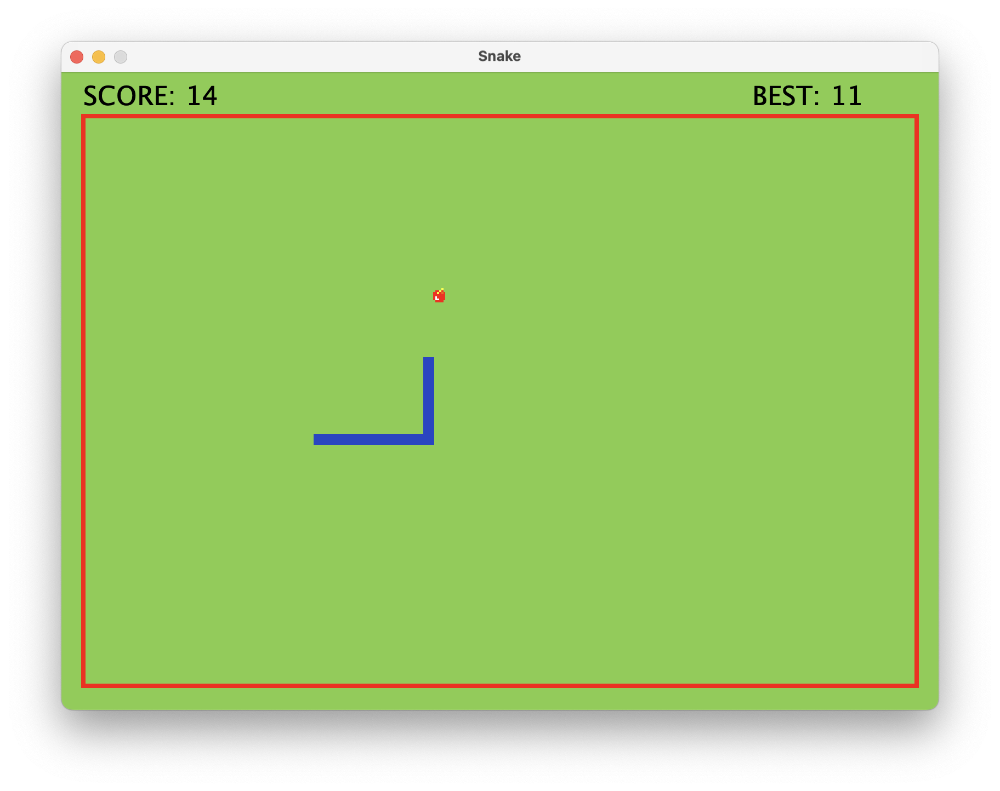
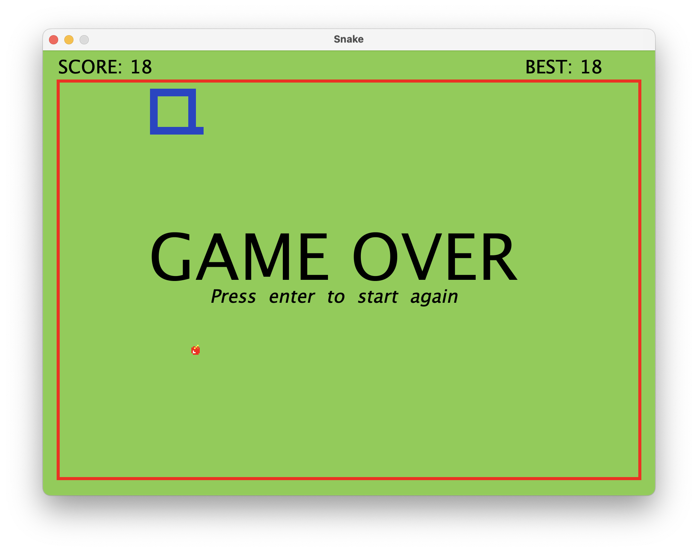

# Snake Game

## Overview

This is a simple GUI-based Snake game implemented in Java using Swing for the graphical user interface. The classic Snake game allows the player to control a snake on the screen, eat food, and grow longer. The game ends if the snake collides with itself or the boundaries of the playing area.

## Features

- **Graphical User Interface:** The game features a graphical user interface built with Java Swing, providing a visually appealing gaming experience.
  
- **Scoring:** Players earn points for each food item eaten, and the score is displayed on the screen.

- **Game Over Screen:** When the game ends, a Game Over screen is displayed, showing the player's final score.

## Requirements

- Java Development Kit (JDK) 8 or higher

## How to Play
- Use the arrow keys to control the direction of the snake: Up, Down, Left, and Right.
- Press P to pause the game.
- If the game is not started, press any key to begin.
- When the game is over, press Enter to start a new game.

## How to Run

1. Clone the repository to your local machine:

   ```bash
   git clone https://github.com/your-username/Snake-Game.git
   ```

2. Navigate to the project directory:

   ```bash
   cd Snake-Game
   ```

3. Compile the Java files:

   ```bash
   javac SnakeGame.java
   ```

4. Run the game:

   ```bash
   java SnakeGame
   ```

## Controls

- **Arrow keys:** Control the direction of the snake (Up, Down, Left, Right).
- **P:** Pause and resume the game.
- **Enter:** Start a new game after Game Over.

## Screenshots





## Contributing

If you'd like to contribute to the development of this Snake game, feel free to fork the repository and submit a pull request with your changes.
